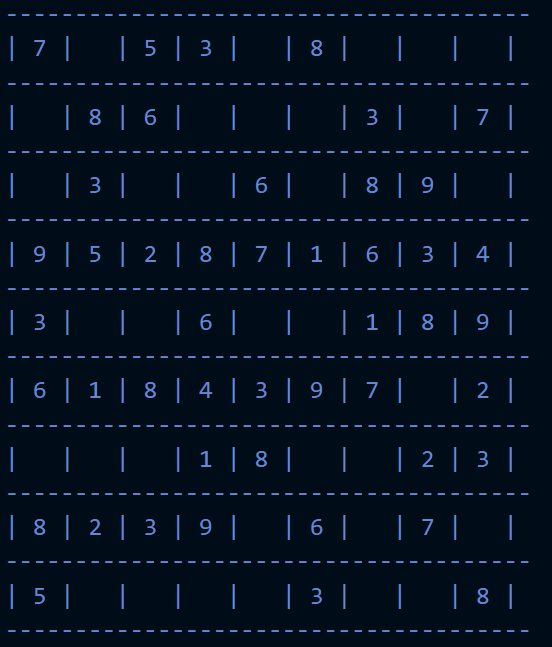
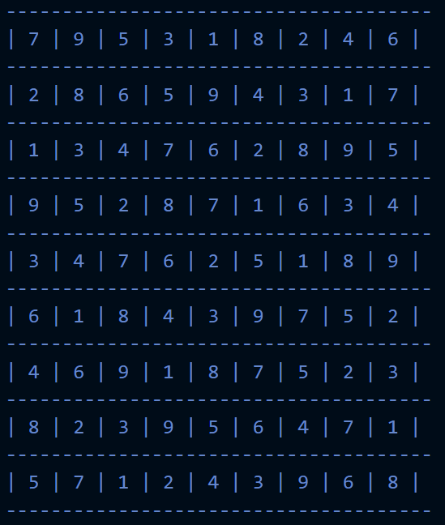

# Sudoku Solver

It uses simple back tracking approach and solves sudoku.

**Note:** The example.py contains a simple sudoky example question that is used in the script.

You can modify the script acording to your need 😀 

## Example

### Puzzle : 

### Solution
